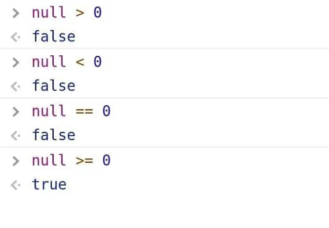

I hope that everyone had a fantastic first week of our web programming class! I am thrilled to be teaching this course this semester, and I am eager to help all of you learn the ins and outs of web programming, including the powerful and versatile JavaScript language.

This semester is going to be an excellent one, and I am confident that each of you will leave the class with a deep understanding of the building blocks of the web. To help ensure your success, I want to bring to your attention that [office hours](docs/information/office-hours/) are now posted and available for you to use. I encourage all of you to take advantage of this valuable resource and stop by for any questions or concerns you may have.

Flexible learning is at the forefront of this class, and we are here to support you in any way that we can. Whether you are a beginner just starting out or have a little background in web programming, we believe that this class will have something for everyone. So let's have fun and charge into week two!

