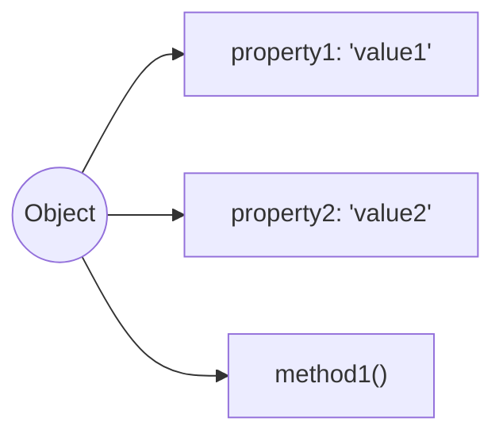
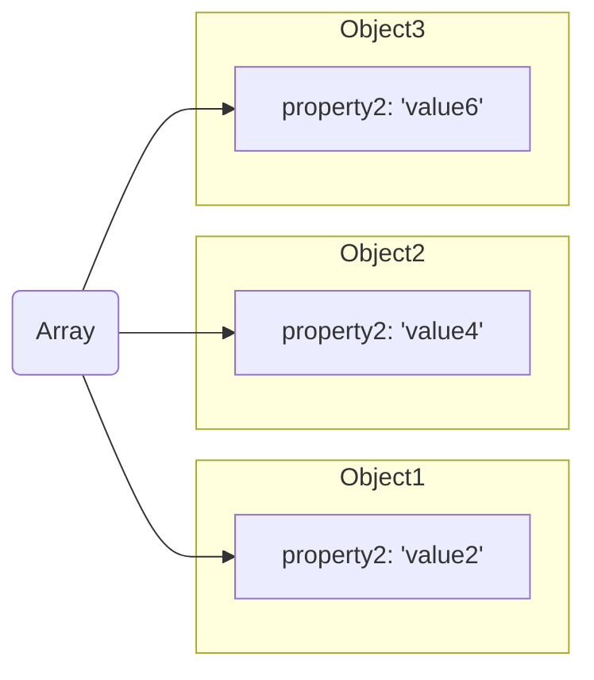

# L04 Objects

## Overview

In JavaScript, an object is a data structure that allows you to store
and organize data in a more complex way than primitive data types like
numbers and strings. Objects can contain properties, which are
key-value pairs, as well as methods, which are functions that can be
called on the object.

## Creating an Object

There are a few different ways to create an object in JavaScript. One
common method is to use object literal notation:

```javascript
const myObj = {
  property1: 'value1',
  property2: 'value2',
  method1: function() {
    console.log('This is a method.');
  }
};
```

This creates an object with two properties (`property1` and
`property2`) and one method (`method1`).

## Accessing Object Properties

You can access object properties using dot notation or bracket notation:

```javascript
console.log(myObj.property1); // Output: 'value1'
console.log(myObj['property2']); // Output: 'value2'
```

## Memory Diagram of an Object

To better understand how objects work in JavaScript, let's take a look
at a memory diagram of an object:



In this diagram, the `Object` is represented by a circle, and its
properties (`property1`, `property2`) and method (`method1`) are
represented by rectables connected to the `Object` circle.

Here is a more in depth diagram:



In this diagram, A JavaScript array named `Array` is represented by a
rectangle, and each of the three objects (`Object1`, `Object2`, and
`Object3`) are represented by larger rectangles. The objects each
contain two properties (`property1` and `property2`) represented by
rectangles. The values of the properties are also shown in the
circles.

## Conclusion

JavaScript objects are a powerful tool for organizing and manipulating
data in your code. By understanding how objects work and how to create
and access their properties and methods, you can take your

## Slides

import { PowerPoint } from '@site/src/components/PowerPoint'

<PowerPoint lec_src={require('./04-objects.pptx').default} />

## Code Examples

- [examples/04-objects](https://github.com/umass-cs-326/examples/tree/main/04-objects)

You can view all of the examples by cloning the [examples repository](https://github.com/umass-cs-326/examples).

## Resources

### MDN Web Docs

- [JavaScript](https://developer.mozilla.org/en-US/docs/Web/JavaScript)
- [JavaScript data types and data structures](https://developer.mozilla.org/en-US/docs/Web/JavaScript/Data_structures)
- [Object](https://developer.mozilla.org/en-US/docs/Web/JavaScript/Reference/Global_Objects/Object)
- [Functions](https://developer.mozilla.org/en-US/docs/Web/JavaScript/Guide/Functions)
- [this keyword](https://developer.mozilla.org/en-US/docs/Web/JavaScript/Reference/Operators/this)
- [JavaScript OBJECTS in ONE Video](https://www.youtube.com/watch?v=37YIF_evtEk)


### VSCode

- [VSCode Live Server](https://marketplace.visualstudio.com/items?itemName=ritwickdey.LiveServer), an extension we will end up using quite a bit for several weeks.

