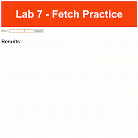

# B07 Fetch Practice

## Information

- Please accept the [GitHub Classroom Assignment](https://classroom.github.com/a/2PF91jJz) for this lab
- See the [calendar](/docs/information/schedule/#labs) for due dates.

## Submission

You must submit the following to complete this assignment:

- Push all changes to your GitHub repository before the due date. You do not need to submit anything to Moodle. We will take your last commit before the deadline as your submission.

---

## Overview

We've recently learned about the Fetch API in JavaScript, as well as an introduction to Asynchrony. Today we'll be practicing these skills by checking out a [Free Dictionary API](https://dictionaryapi.dev/).

## Using `fetch()`

As a recap, the Fetch API allows us to fetch resources from an external resource. Here's how you might use fetch in a typical JavaScript program:

```javascript
async function fetchData() {
  const response = await fetch("https://jsonplaceholder.typicode.com/posts");
  const data = await response.json();
  console.log(data);
}

fetchData();
```

## Dictionary API

This free dictionary API allows a user to query various definitions of words. The URL to request information about a word is ` https://api.dictionaryapi.dev/api/v2/entries/en/<word>`, where `<word>` can be anything the user inputs. Let's look at an example where we look up the word "hello":

```json
 https://api.dictionaryapi.dev/api/v2/entries/en/hello

 [
    {
      "word": "hello",
      "phonetic": "həˈləʊ",
      "phonetics": [
        {
          "text": "həˈləʊ",
          "audio": "//ssl.gstatic.com/dictionary/static/sounds/20200429/hello--_gb_1.mp3"
        },
        {
          "text": "hɛˈləʊ"
        }
      ],
      "origin": "early 19th century: variant of earlier hollo ; related to holla.",
      "meanings": [
        {
          "partOfSpeech": "exclamation",
          "definitions": [
            {
              "definition": "used as a greeting or to begin a phone conversation.",
              "example": "hello there, Katie!",
              "synonyms": [],
              "antonyms": []
            }
          ]
        },
        {
          "partOfSpeech": "noun",
          "definitions": [
            {
              "definition": "an utterance of ‘hello’; a greeting.",
              "example": "she was getting polite nods and hellos from people",
              "synonyms": [],
              "antonyms": []
            }
          ]
        },
        {
          "partOfSpeech": "verb",
          "definitions": [
            {
              "definition": "say or shout ‘hello’.",
              "example": "I pressed the phone button and helloed",
              "synonyms": [],
              "antonyms": []
            }
          ]
        }
      ]
    }
  ]
```

As you can see, we get back an array that contains an object with all the relevant information we want. In this object, we have access to the `meanings` property, which is an array of the different meanings a word might have. For this lab, we are interested in each meaning, it's `partOfSpeech`, and the first `definition` in the resulting `definitions` array.

## TODO

Take a look at `index.html`. We have a search box where we can input a word and hit a button to see the results. The `results` div should end up containing each meaning of the word from the API in a way that looks like this:

```html
<div class="results" id="results">
  <!-- This is an example of a resulting meaning div. You must create these elements programatically in Javascript! -->
  <div id="meaning-1">
    <h2>Meaning #1</h2>
    <h3>Part of Speech: ></h3>
    <h3>Definition:</h3>
  </div>
</div>
```

Your task is to use the `fetch()` API to get all the meanings of the input word and render them on the webpage programatically, similar to how you've been rendering grid elements in your homework. More specifically, you must loop over all the meanings and create the following:

- Each meaning should get it's own `div` with the id `meaning-X` where X is the `i+1`th element in the resulting meanings array from the API
- Each meaning div should have an `h2` tag with the text "Meaning #X" where X is the `i+1`th element in the resulting meanings array from the API
- Each meaning div should have an `h3` tag with the text "Part of Speech: \<partOfSpeech\>"
- Each meaning div should have an `h3` tag with the text "Definition: \<definition\>", where `definition` is the first definition in `meanings[i].definitions`

You do not need to worry about any CSS, that is already handled for you.

Here is an example of the final product (the text might be hard to read cause of compression):



### Tips

- Once you're able to successfully fetch the data, try using `console.log()` on the data and interact with it in your browser's console. Make sure you understand the data structure of the results before you create your HTML elements
