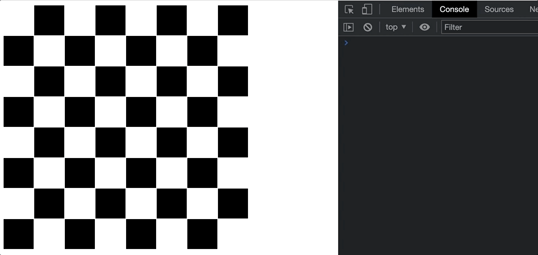

# Ex8: 8x8 Chessboard

## Information

- Visit Moodle and follow the GitHub Classroom assignment link.
- See the [calendar](/docs/information/schedule/#exercises) for due
  dates.

## Submission

You must submit the following to complete this assignment:

- Push all changes to your GitHub repository before the due date. You
  do not need to submit anything to Moodle. We will take your last
  commit before the deadline as your submission.
- Complete the Grade Reflection survey associated with this assignment
  on Moodle.

See the [course syllabus](/docs/information/syllabus/#exercises) for
additional information on exercise assignments.

## Overview
In this exercise you will make a full chess board (8x8) that uses a css grid and changes colors as you hover, revealing the text, and the text indicates which piece is at the relevant position:

"rook", "knight", "bishop", "queen", "king", "bishop", "knight", "rook", "pawn"

When you click on a square, it will print to the console the coordinates of the square:

## Starter Kit

:::note

Follow the GitHub Classroom assignment link on Moodle first.

:::

You are provided three files: `chessboard.html`, `chessboard.css`, and `chessboard.js`. The HTML file provides the necessary tags to load in both the CSS and JS files. You do not need to modify this file. Your job is to complete the CSS and JS files to create this 8x8 chessboard application.

## TODO #1: CSS

Complete the CSS in `checkerboard.css` provided in the starter kit to duplicate the visual effects shown in the animated image above.

You will find `TODO #1` in the `chessboard.css` file.

## TODO #2: JavaScript

Complete the JS in `checkerboard.js` provided in the starter kit to duplicate the console output behavior shown in the animated image above.

You will find `TODO #2` in the `chessboard.js` file.

