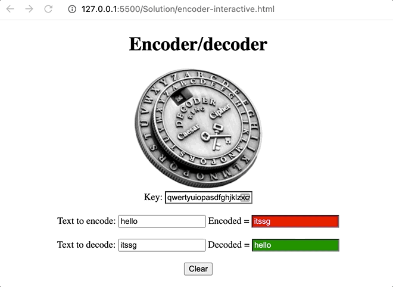

# Ex9: Persistent Encoder

---

# Overview

The goal of this exercise is to add persistence to the encoder application we saw in a previous exercise. In particular, you will be implementing an application that works identical to the previous encoder/decoder exercise. However, you will extend this application to support persistence using browser local storage. That is, if you reload the page it will keep the text that has been entered into the editable text boxes.

# Starter Kit

[Download the Starter Kit!](https://drive.google.com/drive/folders/1hdJsrHDXbBDlsVm74GcAgQajFPMzHvOw?usp=sharing)

You are provided two files: **encoder-interactive.html**, **interactive.js**, and **decoder.js**. The HTML file provides the necessary tags to load in both the CSS and JS files. You will be modifying this file to add a button. In the **interactive.js** file you will be adding the necessary logic for data persistence. You do not need to modify the **decoder.js** file. This contains the decoder functionality from the previous exercises.

# TODO #1: (HTML) Adding a button

You are welcome to use your previous solution, however, the instructions for this exercise are based off of our solution and the starter kit that will help you get started. Here is the modifications you need to make to **encoder-interactive.html**:

1. Add a “clear” button that will be used to clear local storage and the content of the text boxes that you have typed into. You can see the button in the image above.

You will find **TODO #1** in the **encoder-interactive.html** file.

# TODO #2: (JavaScript) Adding persistence behavior

Complete the JS in **interactive.js** provided in the starter kit to add persistence of the UI data and clear the UI data as shown in the animated image above. Follow the steps below:

1. Add event handlers for the cipher _key_, _encode_, and _decode_ text boxes that will save the content of each of these text boxes to local storage.
2. Add an event handler for the clear button such that when the user clicks the button it will clear the local storage state and the text boxes.
3. Call the **restoreState** function to restore the state of the text boxes.
4. Implement the **saveState**, **restoreState**, and **clearState** functions.

You will find **TODO #2** in the **interactive.js** file.

# Submission

You must do the following to submit this assignment:

* Create a Zip archive of the folder containing your solution files.
* Upload this Zip file to the Moodle assignment.
* Check to make sure you uploaded your Zip archive to the Moodle assignment.
* Check again.

# Rubric and Grading

Use the following rubric to satisfy the requirements of this assignment. We will be using this rubric to score your submission

## Exercise (2 points)

* 2 points, a reasonable attempt was made at completing the exercise, a solid attempt was made at completing all TODOs.
* 1 point, an attempt was made, but was incomplete or had missing or empty parts, not all TODOs were completed, minimal work.
* 0 points, empty or no submission.