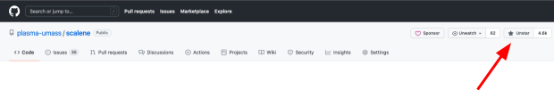
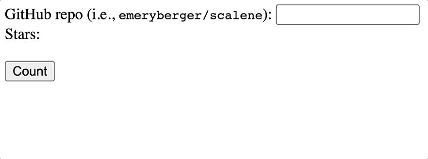

# Ex11: REST and Fetch

## Overview

The goal of this exercise is to implement a web app that takes a GitHub repository and name (e.g., plasma-umass/scalene) and then fetches the number of “stars" which the repository has (displayed on the upper-right hand side of GitHub repositories).

This is what the app will look like when you run it:

## Starter Kit

:::note

Follow the GitHub Classroom assignment link on Moodle first.

:::

You only need to edit the file `starbuddy.js`, but you will need to consult `starbuddy.html`.

## Submission

You must submit the following to complete this exercise:

1. The associated assignment survey on Moodle.

You must ensure that you have completed this exercise and committed your work to your GitHub repository before submitting the assignment survey on Moodle. You are required to submit a link to the commit that you are self reviewing and that we may use to review your work.

Your submission time/date is based on the time/date of the assignment survey submission available from Moodle. You are responsible for ensuring that your submission is complete and accurate.

If your survey submission is late, tokens will be automatically deducted from your token count. You will be notified of the number of tokens deducted from your token count as part of your score report in an email.

## 😎 Meeting Standards 😎

**Meeting Standards is considered B-quality work**.

This level of work meets the requirements of the assignment. It is expected that you will be able to complete this level of work with minimal assistance and complete it by the assigned due date with a correct solution. By completing this level of work, you will be able to demonstrate that you have met the learning objectives of the assignment and of the course and are prepared to be successful in future assignments and subsequent courses that have this course as a prerequisite.

### TODO #1: Add Event Listener

First, you will implement the code (one line) in the function `initialize` to add an event listener to the button (consult `starbuddy.html`).

You will find **TODO #1** in the `starbuddy.js` file.

### TODO #2: Fetch the Stars

Second, implement the function `getStars` that uses the fetch API. You will need to `await fetch` first to get the response from the server, and then `await response.json()` to get the JSON out of the response.

Your function should then update the `
` that will contain the star count (returned from the GitHub API in a JSON object as the property `stargazers_count`). Recall that the API endpoints for GitHub look like this: `https://api.github.com/repos/jvilk/browserfs` (in other words, you can't just use the "repo" `
`  element as the URL!).

If the request fails (`response.ok` is false or `response.status === 404`), your app should report "an error has occurred." Although not typically advisable, use `.innerHTML` to set the contents of the `
` in `starbuddy.html` to make things a little easier. In total, your function should be pretty short: around 10 lines of code.

You will find **TODO #2** in the `starbuddy.js` file.

## 🚀 Exceeding Standards 🚀

**Exceeding Standards is considered A-quality work**.

If you have satisfied the Meeting Standards level of this assignment and you want to go above and beyond, you can try to do one or all of the following:

- Add a loading indicator (e.g., a spinner) while the request is in progress.
- Add a "clear" button that clears the star count.
- Add a "reset" button that clears the star count and the repository name.
- Add a "random" button that fetches a random repository from the GitHub API and displays its star count.
- Add a "top" button that fetches the top 10 repositories from the GitHub API and displays their star counts.
- Add a "bottom" button that fetches the bottom 10 repositories from the GitHub API and displays their star counts.
- Add a "search" button that fetches the top 10 repositories from the GitHub API that match the search query and displays their star counts.
- Add a "sort" button that fetches the top 10 repositories from the GitHub API that match the search query and displays their star counts, sorted by the number of stars.
- Add a "filter" button that fetches the top 10 repositories from the GitHub API that match the search query and displays their star counts, filtered by the number of stars.

You are always welcome to try something else that is not listed here. The sky is the limit! Just make sure you document what you did in the associated submission form.

**You will only receive credit for the Exceeding Standards level of work if you have completed the Meeting Standards level of work. Do not attempt to complete the Exceeding Standards level of work until you have completed the Meeting Standards level of work as it will be ignored.**

## 🕊️ Approaching Standards 🕊️

**Approaching Standards is considered C-quality work**.

This level of work indicates that you are not quite meeting the standards for the assignment, but you are making progress. You should be able to complete the assignment with some guidance and/or additional work. You have demonstrated some understanding of the concepts, but you haven't completely showed that you understand the concepts entirely. You are likely to struggle on future assignments and/or subsequent courses that have this course as a prerequisite.

If you struggled with this assignment, but you understand the concepts and have some understanding of how to solve it, but your application of that understanding is not quite there, incomplete, or incorrect, then your score is at the Approaching Standards level.

You should consider seeking help from another student in the class, a TA/UCA, or the instructor.

## 🛟 Below Standards 🛟

**Below Standards is considered D-quality work**.

This level of work indicates that you are not meeting the standards for the assignment. You do not understand the concepts and/or you have not demonstrated any understanding of the concepts. You have not made any significant progress on the assignment. You are likely to significantly struggle on future assignments and/or subsequent courses that have this course as a prerequisite.

If you struggled with this assignment and you do not understand how to solve it, do not understand where to start, or even entirely understand the code provided or the code you wrote, your score is at the Below Standards level.

You should consider seeking help from another student in the class, a TA/UCA, or the instructor.
