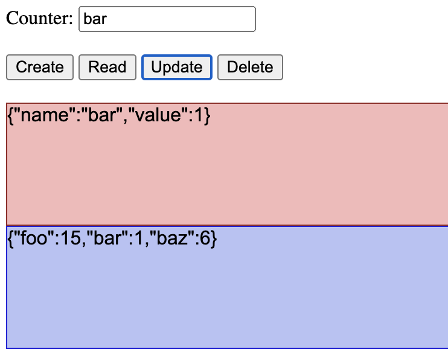

# Ex:13 CRUD #2

## Overview

The goal of this exercise is to extend the basic HTTP server from the last exercise that supported persistence of an object holding data on counters. In particular, we will be doing the following:

1. Use HTTP methods (GET, POST, PUT, DELETE, etc.) on an incoming request object in combination with the path to determine if a route matches a route in the server and invoking the associated operation to handle that request in the server.
2. Add a route in the HTTP server to serve HTML, CSS, and JavaScript files.
3. Add a front-end UI to interact with the CRUD server.

It will be helpful to reference the server code example covered in the associated lesson to provide guidance on the implementation of this exercise. The starter kit we provide also gives you significant direction.

## Starter Kit

## A CRUD Server with a UI

In the last exercise we created a server that provided a RESTful interface and CRUD operations for an HTTP server that managed a “database” of counter variables. We were able to perform several operations on that database by sending the server HTTP requests from the browser and seeing the results in the browser window. In this exercise, we are going to look at a more complete application that will include a front-end interface that will communicate with the back-end REST/CRUD server. In the end, you will end up with an application in the browser that looks like the one below.

## TODO #1: Server Update and Delete

Complete the `updateCounter` and `deleteCounter` CRUD functions in `memcrud.js`. We provide the implementation of the other operations that you can look at for guidance.

You will find **TODO #1** in the `memcrud.js` file.

## TODO #2: Server Methods and Paths

Update the `basicServer` function to check that the request path and HTTP method match to determine if the server functionality should be invoked. You need to complete this for the `/update` and `/delete` route. We provide the others to give you some direction.

You will find **TODO #2** in the `memcrud.js` file.

## TODO #3: Client Update and Delete Buttons

​​Complete the update and delete button’s click event listener functions in `client/client.js` to call the appropriate CRUD operations in `client/crud.js` and update the user interface. We have implemented the others to give you a reference point.

You will find **TODO #3** in the `client/client.js` file.

## TODO #4: Client Update and Delete CRUD Functions

Complete the `update` and `delete` CRUD functions in `client/crud.js`. These functions use the `fetch` web API call to make the proper request to the server to update and delete counter data.

You will find **TODO #4** in the `client/crud.js` file.

## Submission

You must do the following to submit this assignment:

* Create a Zip archive of the folder containing your solution files.
* Upload this Zip file to the Moodle assignment.
* Check to make sure you uploaded your Zip archive to the Moodle assignment.
* Check again.

## Rubric and Grading

Use the following rubric to satisfy the requirements of this assignment. We will be using this rubric to score your submission

### Exercise (2 points)

* 2 points, a reasonable attempt was made at completing the exercise, a solid attempt was made at completing all TODOs.
* 1 point, an attempt was made, but was incomplete or had missing or empty parts, not all TODOs were completed, minimal work.
* 0 points, empty or no submission.