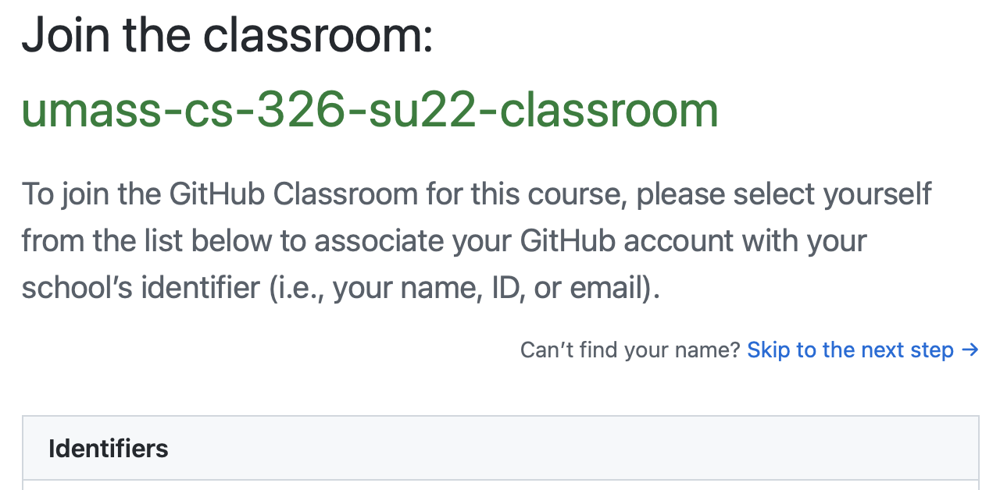

# Hw1: GitHub Classroom


## Information

- Visit Moodle and follow the GitHub Classroom assignment link.
- See the [calendar](/docs/information/schedule/#homework) for due dates.

## Submission

You must submit the following to complete this assignment:

- Push all changes to your GitHub repository before the due date. You do not need to submit anything to Moodle. We will take your last commit before the deadline as your submission.
- Complete the Grade Reflection survey associated with this assignment on Moodle.

## Overview

In this course, most of the assignments are distributed using GitHub Classroom. GitHub Classroom uses Git to organize assignments that are stored in Git repositories. The goal of this homework is to get you familiar with Git, GitHub, and GitHub Classroom. This course uses Git extensively to help you practice using version control which is an extremely important tool in the context of software development as well as other disciplines that need a fine-grained method for versioning files. We use GitHub Classroom as a place to manage assignment repositories. 

## Task 1 – Accept GitHub Classroom Link

The following is step-by-step instructions on how to accept your first GitHub Classroom assignment. Follow these instructions in sequence to successfully gain access to this first assignment.

### Step 1

The first thing you need to do is click on the GitHub Classroom assignment link provided with this homework in the LMS that we are using (e.g., Moodle). Once you click on that link you will see a message similar to the one to the left. It is asking you to join the classroom. You need to find your UMass username or email address in the list of “Identifiers”. Once you find it, click on it to continue. If you do not find it, post to Piazza so we can fix that.



### Step 2

After you click on your UMass username you then need to click OK to confirm.


### Step 3

Next, you need to accept the assignment. Notice that it will create a unique repository name that will be associated with your UMass username.


### Step 4

Now you need to wait a short period of time for GitHub Classroom to create your repository. You must refresh the web page to see when it completes.


### Step 5

After a few browser refreshes it will display the link to your repository. Click on that link to open your GitHub repository.


After you follow those steps, you have a GitHub repository connected to GitHub Classroom. The instructors of this course will have access to your repository and be able to see the work that you commit. This allows us to help you as you complete assignments as well as see your progress. Your repository will look something like this (this may vary depending on the semester):


## Task 2 - Clone the Assignment Repository

Now that you created the homework repository, you want to clone that repository to your local machine. We will discuss two ways of doing this. The first way is to use the command prompt. The second way is to clone the repository through VSCode.

### Command Prompt Method

You will need to open a command prompt (this will differ depending on which operating system you are using) and navigate to a folder in which you want to clone your assignment repository into. Once you are in that folder you want to type in the following command :

```bash
git clone YOUR_REPOSITORY_URL
```

You will need to replace YOUR_REPOSITORY_URL with the name of the repository that was created for you when you accepted the assignment. Here is an example of what this might look like (depends on the semester):

```bash
git clone https://github.com/umass-cs-326-summer/homework-01-github-classroom.git
```

After you type this command you may be asked to enter your GitHub username and password. If you encounter an error, you may need to create a personal access token to clone your repository successfully. To create a personal access token, you should follow the instructions in [How To: Clone GIT Repo Using Personal Access Token](https://www.shanebart.com/clone-repo-using-token/). You can read more about the reasoning behind GitHub’s decision to require a personal access token in this [article](https://www.howtogeek.com/devops/how-to-set-up-https-personal-access-tokens-for-github-authentication/#:~:text=As%20of%20August%202021%2C%20Github,use%20instead%20of%20your%20password.).

After you run this command, you will see a folder that was created containing the starter repository. You can open this folder in VSCode. There are several ways of doing this depending on the operating system you are using. In Windows, you can right click on the folder and click on “Open with VSCode”. On a Mac, you can drag the folder onto the VSCode application. You can also open VSCode and click on the “Explorer” button on the Activity Bar. Then click on “Open Folder”


### VSCode Method

Another way to clone your repository is directly from VSCode. We will not explain the details in this document, but you are welcome to look at [this brief video](https://youtu.be/ILJ4dfOL7zs) to show you how.

### GitHub Desktop Method

Lastly, you can use GitHub Desktop to clone your repository. See [this video](https://youtu.be/8Dd7KRpKeaE) to learn how to do that. You are welcome to use whichever method you prefer, but we will mostly be demonstrating how to work with Git from the command line.

## Task 3 - Configuring Names and Emails

For you to be identified properly when you make changes to your repository, you need to configure Git to use your name and email. You must run these two commands from a command prompt to accomplish this:

```bash
git config --global user.name "John Doe"
git config --global user.email johndoe@example.com
```

You must replace the value for `user.name` with your actual name and `user.email` with your actual email.

**It is extremely important that you provide your credentials, otherwise it is impossible to identify your commits in your Git repositories. Do not skip this step!**

## Task 4 - Making Changes, Adding, and Committing

Now you are ready to work with your homework repository. This homework has a simple task. You will notice a `PROFILE.md` file in the homework repository folder. Open that file in VSCode.

Follow these steps to be successful:

1. Replace the **[Your Name Here]** and **[Your Email Here]** text fragments with your name and your email.
2. Next, we want to commit this change to the repository. Run these commands from the command prompt inside your repository folder. These commands will add your changed file to the “staging” area and then commit them to the repository.

   1. `git add .`
   2. `git commit -m “Added my name and email”`

  You can also do this through VSCode by clicking on the Git icon in the Activity Bar. If you are interested in learning more on how to do that I suggest you google VSCode and Git to learn more.
1. Next, go to the end of the `PROFILE.md` file. You will find a `TODO` that asks you to add a little bit about yourself. Replace that `TODO` with a paragraph about yourself. You can write anything you would like. It also asks you to write something about what you are expecting out of this course. Let us know!
2. After you write the paragraph and feel like you have something done, you need to run the same commands again, but with a different “message”.

    1. `git add .`
    2. `git commit -m “Added my paragraph”` 

That is all you need to do here!

## Task 5 - Pushing

You have made changes to your local repository on your computer and added and committed those changes to the repository on your computer. Next, you want to copy those changes to the remote copy of your repository on GitHub. To do that we use the push command.

```bash
git push
```

The output of that command will look something like this:


After you push your changes, you are done!

## Submission

The only requirement for submission is to push your changes to GitHub before the deadline. You do not need to submit anything to Moodle. We will take your last commit before the deadline as your submission.
