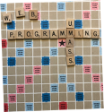

# HW2: Scrabble Starter



## Overview

This is the first part of a series of assignments around the game of Scrabble. We hope that it will be a fun experience in progressively learning all the pieces surrounding modern web development, to engineer a fully functional game. In this assignment, you will build a collection of functions that we will use in future homework to build a (mostly) complete scrabble game web application.

**This assignment has a total of 12 points.**

---

## GitHub Classroom and Workflow

All homework assignments use GitHub Classroom. To start this assignment, you must click on the GitHub Classroom link and accept the assignment to create your initial GitHub repository. You must then use the git clone command to clone that repository to your local computer to begin work. If you forget how to do this, refer to the first homework assignment and related material. We recommend the following workflow to complete homework assignments:

1.  Accept the GitHub Classroom link
2.  Clone your repository to your local computer
3.  Do the following until your homework is complete<sup>1</sup>

    3.a Make incremental required additions/edits/changes to the source code

    3.b Add those changes to your repository:

        `git add .`

    3.c Commit those changes:

        `git add -m "a short message about changes`

    3.d Push those changes to GitHub:

        `git push`

4.  Copy your GitHub repository URL into the Moodle assignment and submit

<sup>1</sup> _You can also use GitHub Desktop and/or VSCode to do this_

---

## General Guidelines

Here are a few general guidelines for this assignment:

It will be helpful to come up with test cases using `console.assert`. This will give you some assurance that your code is working properly. We encourage you to share test cases that you develop with others taking this class. This will make everyone’s code better and is how quality assurance (QA) can work in practice.

This is an individual assignment, and you cannot share code. We will run submissions against a plagiarism detection tool to ensure that academic dishonesty has not taken place.

We will be spot checking your code for good coding practices. It is expected your code does not contain (1) extraneous variables/code, (2) missing semicolons, (3) missing curly braces, and (4) use of double equals. Furthermore, you should use whitespace consistently and make the code legible. Many of these issues will be recognized by VSCode and either suggested as corrections or automatically corrected when you save your code.

---

## Starter Code

The starter code provided below is a skeleton of the code you will be writing. Here is a brief description of each of the files:

- `dictionary.js`: This file contains the dictionary of words that will be used in the scrabble game.
- `index.html`: this file contains some HTML code that is used to run the `scrabbleUtilsTest.js` file. There is nothing you need to do with this file.
- `README.md`: this file contains a brief description of the project. All GitHub repositories should have this file.
- `scrabbleUtils.js`: this file contains the functions you will be writing. You will need to fill in the TODO's with your own code. The TODO's are marked with a // TODO #k comment, where k is the number of the TODO.
- `scrabbleUtilsTest.js`: this file contains some test cases that will be used to test your code. You should add your own tests – this is what every good programmer should do. This file will be run when the index.html file is loaded into the browser.

To run this "application" it is recommended that you use the  VSCode extension. You simply right-click on the `index.html` file and select _"Open with Live Server"_. This will automatically run a web server on your local machine and point your browser to the local server which will load the index.html file into the browser.

---

**Please complete all the TODOs in the code.**

## What you need to do

### Todo #1: Work Checker

In Scrabble, a player has a collection of tiles where each tile is bearing a single character (the letter) as depicted here:


The goal of the game is to form words from these tiles held in a _rack_ that are valid according to the rules of the game. To implement Scrabble as a web application we will need to implement the game using data and functionality in the JavaScript programming language. The first function we need to write is the `canConstructWord` function which can be found in the `scrabbleUtils.js` file. This function is used to perform one of the most important parts of the game which is to determine whether a player has the necessary tiles to construct a given word. The signature of this function looks like this:

    function canConstructWord(availableTiles, word)

This function has two parameters: the available tiles the player has (and how many) and a word the player wants to construct. The former is an object mapping letters to their frequencies. That is, the properties are the letters, and the values of those properties are the number of tiles the player has in their rack. The latter is simply a string. Scrabble also has blank “wildcard” tiles that we will represent with the ‘\*’ (asterisk) character. A wildcard tile can be used in place of any character.

**Additional specifications for this function include:**

- You may not modify the function arguments.
- You can assume the letters in the availableTiles object are always lowercase.
- You can assume that the word string is always lowercase.

Here is an example of how you call this function:

```javascript
canConstructWord({ a: 1, c: 2, t: 1 }, 'cat'); // => true
canConstructWord({ *: 1, c: 2, t: 1 }, 'cat'); // => true
```

This function is labeled as **TODO #1** in the `scrabbleUtils.js` file provided with the starter code for this homework.

_You must implement this function._

---

### TODO 2: Base Score Calculator

The next function we need to write is the `baseScore` function which is used to calculate the base score of a word. The signature of this function looks like this:

    function baseScore(word)

This function has one parameter: `word`. The word is a string. The base score of a word is the sum of the scores of each letter in the word. For example, the base score of the word ‘cat’ is 3 + 1 + 1 = 5, if the letters ‘c’, 'a' and 't' have the scores 3, 2 and 1, respectively. This function returns the base score of the word.

The number of letters and the associated scores for each letter are shown in the list below formatted as **POINTS: LETTER × COUNT.** That is, the number of points for each letter is on the left and the letter is on the right along with the number of those letter tiles that are available in the scrabble game.

- 0 points: blank tiles x2
- 1 point: E ×12, A ×9, I ×9, O ×8, N ×6, R ×6, T ×6, L ×4, S ×4, U ×4
- 2 points: D ×4, G ×3
- 3 points: B ×2, C ×2, M ×2, P ×2
- 4 points: F ×2, H ×2, V ×2, W ×2, Y ×2
- 5 points: K ×1
- 8 points: J ×1, X ×1
- 10 points: Q ×1, Z ×1

You can also find the scoring on Wikipedia<sup>2</sup>

**Additional specifications for this function include:**

- You may assume that the word parameter is non-empty
- You may assume that the word parameter is all lowercase
- You may assume that the word parameter could contain a wildcard character

There are many ways in which to implement this function. We suggest using an object mapping characters to their scores. This function is labeled as **TODO #2** in the `scrabbleUtils.js` file provided with the starter code for this homework.

_You must implement this function._

<sup>2</sup>
[Scrabble letter distributions - Wikipedia](https://en.wikipedia.org/wiki/Scrabble_letter_distributions)

---

### TODO #3: Possible Words

An important goal the human player has in the game of Scrabble is to find a word that they know that can be constructed from the tiles they have in their rack in the context of the words that have already been played on the board. Although this can be a challenge for the human player (depending on their knowledge of words), it is not so hard for a computer to take a giant corpus of words and given a rack of tiles determine the possible words that can be constructed from those tiles.

The next function we want to write is the `possibleWords` function which is used to find all possible words that can be constructed from the tiles the player has in their rack. This function could be used to check if a word played by a player is an actual word (of course this depends on how extensive our dictionary is). The signature of this function looks like this:

    function possibleWords(availableTiles)

This function has one parameter: the available tiles the player has. The available tiles are an object mapping letters to their frequencies. That is, the properties are the letters, and the values of those properties are the number of tiles the player has in their rack.

**Additional specifications for this function include:**

- You may not modify the function argument.
- You can assume the letters in the availableTiles object are always lowercase.

This function is labeled as **TODO #3** in the `scrabbleUtils.js` file provided with the starter code for this homework.

_You must implement this function._

---

### TODO ##4: Best Possible Words

The next function we want to write is the `bestPossibleWords` function which is used to find the best possible words that can be constructed from the tiles the player has in their rack. This function could be used to determine the best possible words that the player can construct from their rack. As we will see in later homework, this function is used to give the player a list of words that they can construct from their rack. The signature of this function looks like this:

    function bestPossibleWords(availableTiles)

**Additional specifications for this function include:**

- You may not modify the function argument.
- You can assume the letters in the availableTiles object are always lowercase.

This function is labeled as **TODO #4** in the `scrabbleUtils.js` file provided with the starter code for this homework.

_You must implement this function._

---

### TODO #5: README.md

It is always important to update a README.md file in your GitHub repository. This final TODO asks you to provide a brief description in the README.md file of the changes you made to the code that was provided. Briefly describe the implementation of your functions in a paragraph or two of text. Please use complete sentences and proper grammar.

---

## Tips

- Write your code in small increments. This will help you identify mistakes early. The more code you write before you test it makes it more difficult to identify mistakes.
- You should commit your code to git regularly. This will help you keep track of your progress. You can see how many commits you have made by using `git log` in the terminal.
- You should push your code to GitHub regularly. This will allow the course staff to easily see your progress and see your code if you are having problems.
- Use `console.log` for debugging purposes. The output of this function will be displayed in the browser console.
- Use `console.assert` for testing your code. Write additional tests to the `scrabbleUtilsTest.js` file. Share your tests with your classmates.

## Submission

You must do the following to submit this assignment:

- Push your final changes to GitHub using the `git push` command.
- Copy/paste the URL of your GitHub repository into the Moodle assignment. The Moodle assignment should have a text box for you to paste in your GitHub repository for this assignment. Make that URL a clickable link in the Moodle textbox (makes it easier for us to click on the link to view your repository).

## Rubric and Grading

Use the following rubric to satisfy the requirements of this assignment. We will be using this rubric to score your submission

### Git and Github (4 points)

- 4 points, if you successfully created a GitHub repository, you have more than 5 commits to that repository, your commit messages are short and descriptive, your README.md file explains briefly, clearly, and concisely how you implemented each function.
- 3 points, if you successfully created a GitHub repository, you have some number of commits, your commit messages are short, your README.md file explains how you implemented each function.
- 2 points, if you successfully created a GitHub repository, you have a few commits, you have commit messages, your README.md file has a short explanation of your implementation or possibly none.
- 1 point, if you successfully created a GitHub repository, you have 1 or 0 commits, your README.md file has no changes or very little.
- 0 points, if you do not have a GitHub repository.

### Functions (4 points)

- 4 points, if all functions appear to be implemented correctly, your code is properly indented, commented, and clearly written, no redundancy in your code, no extraneous variables, loops, or conditional statements, your code is concise and uses the JavaScript programming language features to your advantage.
- 3 points, if all functions appear to be implemented mostly correct, your code is mostly properly indented, commented, and clearly written, there may be some redundancy and/or extraneous variables, loops, or conditional statements.
- 2 points, not all functions are implemented correctly, the code may or may not be indented properly, there are possibly redundancies and/or extraneous variables, loops, or conditional statements, comments are not used consistently, the code is difficult to read and/or follow.
- 1 point, the functions are partially implemented and mostly not correct, comments may or may not exist, there are possible redundancies and extraneous variables, loops, or conditional statements, the code is poorly written.
- 0 points, minimal to no changes.

### Tests (4 points)

- 4 points, there are multiple tests for each function, and they demonstrate edge cases that could potentially cause the functions to fail.
- 3 points, there are multiple tests for each function that test the functions adequately.
- 2 points, there are tests for most functions, but not all.
- 1 point, there is 1 or 2 tests.
- 0 points, no tests provided.
