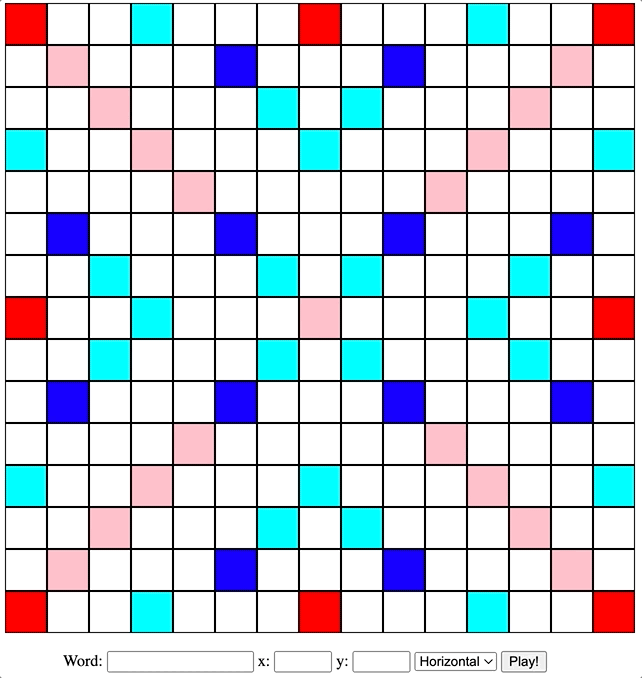
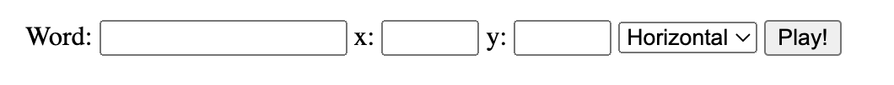

# Hw3: Rack & Render

## Information

- Visit Moodle and follow the GitHub Classroom assignment link.
- See the [calendar](/docs/information/schedule/#homework) for due dates.

## Submission

You must submit the following to complete this assignment:

- Push all changes to your GitHub repository before the due date. You do not need to submit anything to Moodle. We will take your last commit before the deadline as your submission.
- Complete the Grade Reflection Survey associated with this assignment. A link to this survey can be found on the course LMS.

## Overview

Hey there, Scrabble enthusiasts! Get ready for the second part of our thrilling Scrabble assignments series! We're excited to help you learn all the pieces of modern web development while creating a fully functional Scrabble game. This assignment is going to be a blast as you dive into writing the game logic using the Game class and Rack class. But that's not all - you'll also get to use JavaScript to dynamically generate HTML and see the Scrabble board come to life in your browser! Get ready for an amazing experience that will boost your web development skills and leave you feeling pumped! Let's go!

In particular, this is what your web application will resemble in the end:



---

## GitHub Classroom and Workflow

All homework assignments use GitHub Classroom. To start this assignment, you must click on the GitHub Classroom link and accept the assignment to create your initial GitHub repository. You must then use the git clone command to clone that repository to your local computer to begin work. If you forget how to do this, refer to the first homework assignment and related material. We recommend the following workflow to complete homework assignments:

1.  Accept the GitHub Classroom link
2.  Clone your repository to your local computer
3.  Do the following until the assignment is complete

    A. Make incremental required additions/edits/changes to the source code

    B. Add those changes to your repository:

        `git add .`

    C. Commit those changes:

        `git commit -m "a short message about changes"`

    D. Push those changes to GitHub:

        `git push`

You are also welcome to use use GitHub Desktop and/or VSCode to do
this, but we highly encourage you to become familiar with the command
line usage **first** as this is 100% expected in industry and academia.

---

## General Guidelines

Here are a few general guidelines for this assignment:

**Use `console.log` to print values to the browser console.** This is a cheap way to ensure that your code is doing what you think it is doing. If nothing displays in the browser window, it is likely that there is an error in your code. Open the console and see if there was an error.

**It will be helpful to come up with test cases using `console.assert`.** This will give you some assurance that your code is working properly. We encourage you to share test cases that you develop with others taking this class. This will make everyone’s code better and is how quality assurance (QA) can work in practice.

**We will be spot checking your code for good coding practices.** It is expected your code does not contain (1) extraneous variables/code, (2) missing semicolons, (3) missing curly braces, and (4) use of double equals. Furthermore, you should use whitespace consistently and make the code legible. Many of these issues will be recognized by VSCode and either suggested as corrections or automatically corrected when you save your code.

**Write code in small increments, continually verify that it is working.** It is strongly encouraged that you write your code in small increments and test (or print) that code at each step of the way. Do not write an entire application and then see if it works. If you can verify that your code is working each step of the way, then you can be confident to extend it further.

Please review the [collaboration policy](/docs/information/syllabus/#collaboration-policy) in the Syllabus for further information on what you can and cannot do in terms of sharing of work.

---

## Starter Code

The starter code provided below is a skeleton of the code you will be writing. Here is a brief description of each of the files:

- `README.md`: this file contains markdown text; always included in a git repository.
- `main.js`: this is the main entry point into the application; loaded by index.html.
- `game.js`: contains code that represents a scrabble game board.
- `rack.js`: contains code that represents a rack of tiles used by a player.
- `scoring.js`: contains code that implements the scoring for the scrabble game.
- `scrabbleUtils.js`: this file contains the utility functions you wrote in the previous homework. It is not used in this homework. You are welcome to copy your implementation here.
- `shuffle.js`: used to shuffle the game tiles.
- `test.js`: contains your tests for `game.js` and `rack.js`.
- `dictionary.js`: This file contains the dictionary of words that will be used in the scrabble game.
- `index.html`: this file is used to display the scrabble board and user interface
- `main.css`: contains the CSS for this web application

To run this "application" it is recommended that you use the [Live Server VSCode extension](https://marketplace.visualstudio.com/items?itemName=ritwickdey.LiveServer). You simply right-click on the `index.html` file and select "Open with Live Server". This will automatically run a web server on your local machine and point your browser to the local server which will load the index.html file into the browser.

:::info

- Please complete all of the TODOs in the code.
- DO NOT DELETE THE TODO COMMENTS IN THE STARTER CODE

:::

## Part 1: The Game Class

You will first implement a `Game` class that will represent (1) a physical Scrabble board and (2) a bag of tiles. The state of the `Game` class must include a 2-dimensional 15x15 grid/array representing the state of the playing board and an array of 100 tiles for each letter tile in the game. We provide you with some starter code to get you going. Please complete the following in the `game.js` file:

### TODO #1: Game Class Constructor

1. (`game.js`) In the constructor, initialize the bag of tiles as an array of 100 tiles for each letter tile (represented simply as a string of 1 characters) in the game. You will need to take into account [the frequency of each letter in the English version](https://en.wikipedia.org/wiki/Scrabble_letter_distributions) to ensure that you have the correct number of tiles for each letter. Once the array has been properly initialized, it should be shuffled using the Fisher-Yates shuffle algorithm we have provided in `shuffle.js`. You should store this bag of tiles as an instance variable of the `Game` class.
2. (`game.js`) In the constructor, create a 15x15 2-dimensional grid/array representing the physical Scrabble game board. This is where tiles will eventually be played. When there is an intentional absence of a value, it is idiomatic in JavaScript to use the `null` value. Since the board is empty when a new `Game` is constructed, each location in the 15x15 grid should be initialized to the `null` value.

:::info

- Look for “TODO #1” in `game.js` and complete the implementation!
- Make small incremental changes and print values out to test your implementation!

:::

<details>
<summary><strong>Tips and Frequency Asked Questions</strong></summary>

There are currently none for this TODO.

</details>

### TODO #2: Game Play

The `Game` class has a `playAt` method which simulates a player playing a word on the board. The signature of this method is:

```js
playAt(word, position, direction)
```

This method has three parameters: `word`, `position`, and `direction`. The `word` parameter is a `string` which represents the word to be played on the board, the `position` is an object of two numbers, where `{x:1, y:1}` is the top-left corner of the board, and the `direction`, which is a `boolean`, where `true` is horizontal and `false` is vertical. The goal of this method is to:

1. Determine if the word can be played on the board at the position and direction (i.e., it can’t overlap existing words or go outside of the game board).
2. If it can be placed on the board, it places it on the board at the given position and directions.
3. If it can be placed on the board, a score is computed and returned as the return value of the method.

You will notice that the general algorithm already exists in this method. However, it makes calls to other methods to accomplish the task. In particular, it calls `_canBePlacedOnBoard` and `_placeOnBoard`, to determine if the word can be placed on the board and then places it on the board if it can. Lastly, if the word can be placed, it calls `scoring.score` to return the word score. We provide the scoring rules in `scoring.js` so you need not worry about that, but your job is to implement the logic of the other two methods. Complete the following:

1. (`game.js`) In `_canBePlacedOnBoard`, determine if the word can be placed on the board. For now, you do not need to consider words that intersect. That is, a word can be placed on the board if all the grid locations are empty. This method returns `true` if the word can be placed; `false` otherwise.
2. (`game.js`) In `_placeOnBoard`, update the game grid with the letters of the word. This method has no return value.

:::info

- Look for “TODO #2” in `game.js` and complete the implementation!
- Make small incremental changes and print values out to test your implementation!

:::

<details>
<summary><strong>Tips and Frequency Asked Questions</strong></summary>

There are currently none for this TODO.

</details>

### TODO #3: Taking Tiles from the Bag

The `Game` class has a `takeFromBag` method which simulates a player taking the first *n* tiles from the tile bag and returning them. If *n* is greater than the number of remaining tiles, this removes and returns all the tiles from the bag. If the bag is empty, this returns an empty array.

:::info

- Look for “TODO #3” in `game.js` and complete the implementation!
- Make small incremental changes and print values out to test your implementation!

:::

<details>
<summary><strong>Tips and Frequency Asked Questions</strong></summary>

There are currently none for this TODO.

</details>

## Part 2: The Rack Class

### TODO #4: Updating Available Tiles from the Bag

Next, you will complete the implementation of the `Rack` class meant to represent the tiles a single player has in front of them. The rack holds the available tiles a player has and includes a `takeFromBag` method, which given a number *n* and a `Game` object, takes *n* tiles from the games’ bag (by calling the `Game` object's `takeFromBag` method). This method updates the player’s available tiles with the *n* tiles it took from the game’s bag.

:::info

- Look for “TODO #4” in `rack.js` and complete the implementation!
- Make small incremental changes and print values out to test your implementation!

:::

<details>
<summary><strong>Tips and Frequency Asked Questions</strong></summary>

There are currently none for this TODO.

</details>

## Part 3: Rendering the Board

Ok, here comes the fun part. After you have verified that your implementation for Part 2 and Part 3 are working (and you really should do this!), you are ready to implement the actual beginning of the user interface (UI). The UI is going to render the 15x15 game board grid along with the controls that will allow us to place words on the board (see the image at the start of this document).

### TODO #5: Render the Board

The `Game` class in `game.js` includes a `render` method. The `render` method is where you will dynamically create DOM elements to represent the scrabble game board. This method takes a single parameter, `element`, which is the DOM element object where the game board will be rendered into. The creation of the `Game` object and the calling to its `render` method are done in `main.js`, which is executed by a `<script>` tag in `index.html`. We have provided the basic machinery which you should read over and understand. Your job is to implement the `render` method to display the board.

You should proceed in the following steps to incrementally render the game board:

1. (`game.js`) Render the 15x15 grid using CSS grids, which you must generate programmatically from JavaScript (the HTML file cannot contain any grid items!). You should do this using the grid that you maintain in the `Game` class. We have defined a board `id` and `grid-item` class in `main.css` to help with the styling of the board.
2. (`game.js`, `main.css`, `scoring.js`) After you are able to render the board, extend your implementation to color the special tiles (those that multiply a letter or a word). The same special tiles should be the same color. You must use classes and CSS styles to accomplish this. You will see some classes already defined in the `main.css` file that correspond to the special tiles. You will need to fill in the styling information. You should also use the `scoring.label` method to get a square’s label which corresponds to the same name as the CSS classes. This will help with generating the appropriate styles for each grid item.

:::info

- Look for “TODO #5” in `game.js`  and `main.css` and complete the implementation!
- Make small incremental changes and print values out to test your implementation!

:::

<details>
<summary><strong>Tips and Frequency Asked Questions</strong></summary>

There are currently none for this TODO.

</details>

### TODO #6: Implement UI Controls

Lastly, you need to implement the user interface (UI) controls for the Scrabble game. The UI controls include a text box to enter in the word to play, The x and y coordinate of the word on the board, the direction as a drop down box, and a button to play the word:



Do the following to implement the controls:

1. (`index.html`) Add the controls as seen above using the appropriate HTML elements.
2. (`main.js`) Add an event listener to the “Play!” button that will retrieve the values from the UI controls, call the `Game` object’s `playAt` method, and then call the `Game` object’s `render` method.

If all goes well, after you click on the “Play!” button the game should display the word in the grid.

:::info

- Look for “TODO #6” in `index.html`  and `main.js` and complete the implementation!
- Make small incremental changes and print values out to test your implementation!

:::

<details>
<summary><strong>Tips and Frequency Asked Questions</strong></summary>

There are currently none for this TODO.

</details>

## Self Scoring and Expectations

The following is a self-scoring rubric for this assignment. You should use this to help you determine if you have completed the assignment correctly. You should also use this to help you determine if you have completed the assignment to the best of your ability. If you have completed the assignment to the best of your ability, you should propose an appropriate score. If you have not completed the assignment to the best of your ability, you should propose a grade that reflects the quality of your work.

- **exceeding expectation**: you completed the TODO and it is correct. The solution was properly designed, all functions/methods/html/css appear to be implemented correctly, your code is properly indented, commented, and clearly written and designed, no redundancy in your code, no extraneous variables, loops, or conditional statements, your code is concise, easy to read, and uses the JavaScript programming language features to your advantage. Not only did you complete the assignment according to the requirements, but you went above and beyond to make it better.
- **meeting expectation**: you completed the TODO and it is mostly correct. All functions/methods/html/css appear to be implemented mostly correct, your code is mostly properly indented, commented, and clearly written, there may be some redundancy and/or extraneous variables, loops, or conditional statements.
- **approaching expectation**: you completed the TODO and it is mostly correct. All functions/methods/html/css are not implemented correctly, but it appears that you were on the right track, work is incomplete, there is effort that is noticeable, possibly confusion with what you were asked to do, needs more work.
- **below expectation**: you worked on the TODO and it is not correct. You may or may not have been on the right track, work is incomplete, difficult to understand, confusion is noticeable, not enough effort, needs substantial work.
- **unable to evaluate**: no submission, minimal changes, nothing to evaluate.

::: info

Complete the Grade Reflection Survey associated with this assignment. A link to this survey can be found on the course LMS.

:::