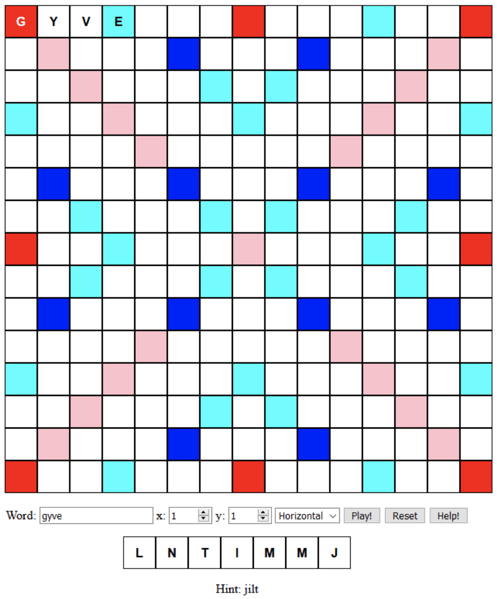
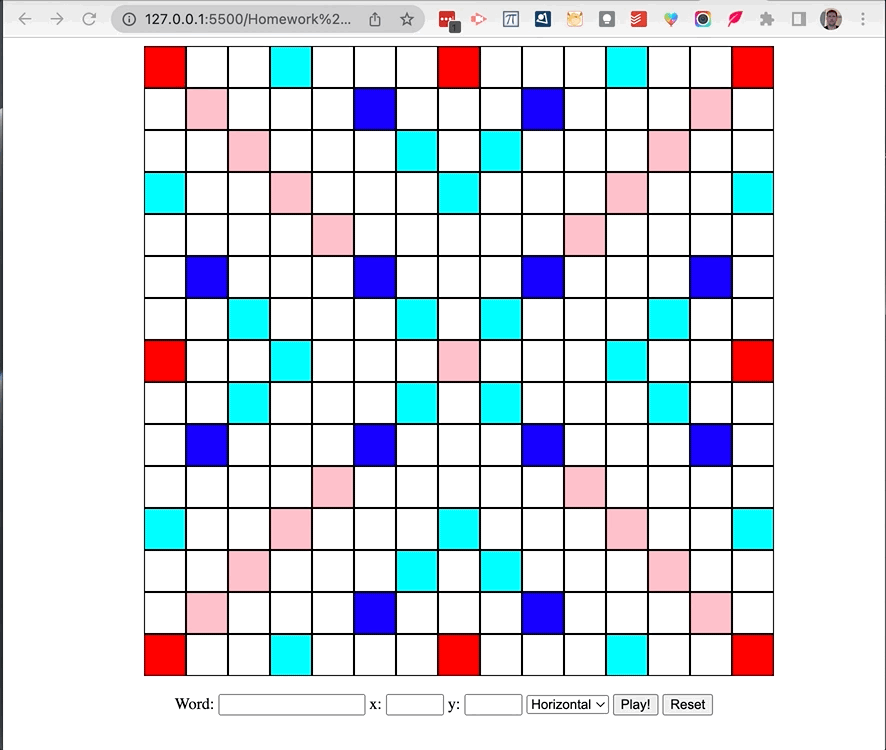
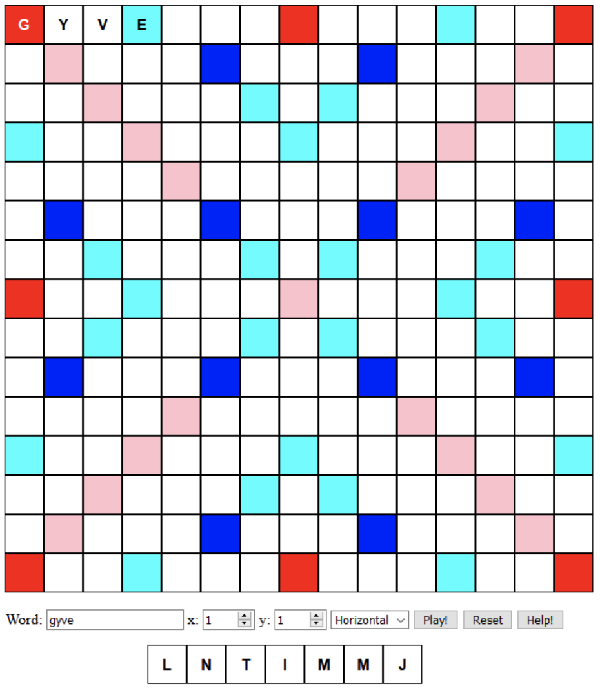

# Hw4: Persistence & Hints

## Information

- Visit Moodle and follow the GitHub Classroom assignment link.
- See the [calendar](/docs/information/schedule/#homework) for due dates.

## Submission

You must submit the following to complete this exercise:

1. The associated assignment survey on Moodle.

You must ensure that you have completed this exercise and committed your work to your GitHub repository before submitting the assignment survey on Moodle. You are required to submit a link to the commit that you are self reviewing and that we may use to review your work.

Your submission time/date is based on the time/date of the assignment survey submission available from Moodle. You are responsible for ensuring that your submission is complete and accurate.

If your survey submission is late, tokens will be automatically deducted from your token count. You will be notified of the number of tokens deducted from your token count as part of your score report in an email.

## Overview

This is the next part of a series of assignments around the game of Scrabble. We hope that it will be a fun experience in progressively learning all pieces of modern web development, so as to engineer a fully functional game. In this assignment, you will add a new functionality to our Scrabble application to save the game state, create one more utility function, do a little refactoring, and add some additional functionality for displaying hints.

In particular, this is what your web application will resemble in the end:

## GitHub Classroom and Workflow

All homework assignments use GitHub Classroom. To start this assignment, you must click on the GitHub Classroom link and accept the assignment to create your initial GitHub repository. You must then use the git clone command to clone that repository to your local computer to begin work. If you forget how to do this, refer to the first homework assignment and related material. We recommend the following workflow to complete homework assignments:

1. Accept the GitHub Classroom link
2. Clone your repository to your local computer
3. Do the following until the assignment is complete

    A. Make incremental required additions/edits/changes to the source code

    B. Add those changes to your repository:

        `git add .`

    C. Commit those changes:

        `git commit -m "a short message about changes"`

    D. Push those changes to GitHub:

        `git push`

You are also welcome to use use GitHub Desktop and/or VSCode to do
this, but we highly encourage you to become familiar with the command
line usage **first** as this is 100% expected in industry and academia.

## General Guidelines

Here are a few general guidelines for this assignment:

**Use `console.log` to print values to the browser console.** This is a cheap way to ensure that your code is doing what you think it is doing. If nothing displays in the browser window, it is likely that there is an error in your code. Open the console and see if there was an error.

**It will be helpful to come up with test cases using `console.assert`.** This will give you some assurance that your code is working properly. We encourage you to share test cases that you develop with others taking this class. This will make everyone’s code better and is how quality assurance (QA) can work in practice.

**We will be spot checking your code for good coding practices.** It is expected your code does not contain (1) extraneous variables/code, (2) missing semicolons, (3) missing curly braces, and (4) use of double equals. Furthermore, you should use whitespace consistently and make the code legible. Many of these issues will be recognized by VSCode and either suggested as corrections or automatically corrected when you save your code.

**Write code in small increments, continually verify that it is working.** It is strongly encouraged that you write your code in small increments and test (or print) that code at each step of the way. Do not write an entire application and then see if it works. If you can verify that your code is working each step of the way, then you can be confident to extend it further.

Please review the [collaboration policy](/docs/information/syllabus/#collaboration-policy) in the Syllabus for further information on what you can and cannot do in terms of sharing of work.

## Starter Code

The starter code provided below is a skeleton of the code you will be writing. Here is a brief description of each of the files:

- `README.md`: this file contains markdown text; always included in a git repository.
- `main.js`: this is the main entry point into the application; loaded by index.html.
- `game.js`: contains code that represents a scrabble game board.
- `rack.js`: contains code that represents a rack of tiles used by a player.
- `scoring.js`: contains code that implements the scoring for the scrabble game.
- `scrabbleUtils.js`: this file contains the utility functions you wrote in the previous homework. It is not used in this homework. You are welcome to copy your implementation here.
- `shuffle.js`: used to shuffle the game tiles.
- `test.js`: contains your tests for `game.js` and `rack.js`.
- `dictionary.js`: This file contains the dictionary of words that will be used in the scrabble game.
- `index.html`: this file is used to display the scrabble board and user interface
- `main.css`: contains the CSS for this web application

To run this "application" it is recommended that you use the [Live Server VSCode extension](https://marketplace.visualstudio.com/items?itemName=ritwickdey.LiveServer). You simply right-click on the `index.html` file and select "Open with Live Server". This will automatically run a web server on your local machine and point your browser to the local server which will load the index.html file into the browser.

:::info

- Please complete all of the TODOs in the code.
- DO NOT DELETE THE TODO COMMENTS IN THE STARTER CODE

:::

## 😎 Meeting Standards 😎

**Meeting Standards is considered B-quality work**.

This level of work meets the requirements of the assignment. It is expected that you will be able to complete this level of work with minimal assistance and complete it by the assigned due date with a correct solution. By completing this level of work, you will be able to demonstrate that you have met the learning objectives of the assignment and of the course and are prepared to be successful in future assignments and subsequent courses that have this course as a prerequisite.

### Part 0: Git Commits

You must have at least 5 GitHub commits to receive credit for this part. It is always good practice to design and develop code incrementally. As part of that process you should be making frequent commits to keep a record of your changes along the way.

### Part 1: Saving the State of the Game

In this first part, you will make it possible for the game state to be saved and restored when the page is reloaded. More precisely, in `game.js`, you should save the grid state and bag state in browser local storage, and restore it when the page loads/reloads. Every time a word is placed on the grid (using the controls from the last homework), the state of the game in storage should be updated. When the page loads, you should check if there is a version in storage, and if there is, you should restore it. You must also extend `index.html` and add a reset button to your user interface controls, which should clear the grid and delete the copy in local storage. After you complete this part, the UI and behavior of the scrabble application will look like this:

The code files you will need to work with in this part are:

- `game.js`: the logic for saving and restoring game state
- `index.html`: the addition of the reset button

### Part 2: Refactor Shuffle

This part is easy! As you may have noticed, the shuffle function in `shuffle.js` is only used in `game.js`. It would therefore make sense to place it in that file, and keep it “private” (which in JS just means to not export it). Therefore, move the shuffle function to `game.js` and delete the `shuffle.js` file. This will also reduce the number of files we are working with. Do not forget to remove the import of `shuffle.js` at the top of `game.js`.

The code files you will need to work with in this part are:

- `game.js`: adding the shuffle function to `game.js`
- `shuffle.js`: removing this file

### Part 3: Checking if a Word is Valid (in the dictionary)

In this part, you will write another utility function which will determine if a word is valid (i.e. it is in the dictionary). The word will be played by the user, and therefore can contain wildcards. The function should return *true* if the input matches any of the words in the dictionary, otherwise it returns *false*. Add a new function called isValid to the `scrabbleUtils.js` file implementing this functionality. Make sure that you export this function from `scrabbleUtils.js`.

The code files you will need to work with in this part are:

- `scrabbleUtils.js`: new function called `isValid`

### Part 4: Rendering and Updating the Rack

This next part is the most difficult in this assignment. It brings together a few parts with some logic to render the board and rack properly. To start, you will render the player’s rack below the board. Remember, the rack is where the player’s tiles that have been drawn from the bag are held. You should initialize the rack by taking 7 random tiles from the bag. You will then connect it to the UI controls in the following way:

1. When the play button is clicked, your code should check if the word is valid (using the `isValid` function you implemented in **Part 3**) and if it can be played with the available tiles. If it cannot be played, you should tell the user using the `alert()` function.
2. If the word can be played, the code should place it on the board, remove the tiles used from the available tiles, take enough tiles from the bag to go back to a maximum of 7 tiles, and rerender the rack.

Here is what the UI should mostly look like after you make these changes:

In a similar fashion as the `Game` class you can implement a `render` method in your `Rack` class (`rack.js`) that takes in the DOM element into which the rack needs to be rendered. You will likely need a few other methods to populate the `Rack` with letters from the `Game`. You will also need to update your `main.css` file with additional rules to display the rack similar to the figure shown above.

We implemented it this way:

- Added a `
` to `index.html` with an `id` attribute set to “rack”
- Added a `render` method to the `Rack` class to render the rack with its letter tiles
- Added some CSS to display the rack as shown above
- Added a `removeTile` method to the `Rack` class to remove a tile from the rack
- Added a few lines of code to `main.js` to create a new `Rack` object, add 7 tiles to the rack by calling its `takeFromBag` method, and rendering the `Rack` with its `render` method
- Added additional code to the event handler for the “Play!” button that includes:
  - Checking if the word played is a valid word in the dictionary using `isValid` that you implemented in the `scrabbleUtils.js` file
  - Checking if the word can be constructed from the available tiles (the `canConstructWord` from `scrabbleUtils.js` is handy along with the `Rack`’s `getAvailableTiles` method)
  - Checking if the word can’t be constructed from the available tiles or if the word isn’t valid. If either is true, then display an `alert` dialog box
  - Otherwise, we then constructed the word from the available tiles (using the `constructWord` function in `scrabbleUtils.js` that we give you) and then we used the `Game`’s `playAt` method to try to play the word
  - If the word can’t be played, we displayed an `alert` dialog box, otherwise we rendered the game board, removed the played tiles from the rack, took new tiles from the bag to replace the played tiles, and rendered the rack with the new tiles

### Part 5: Hints

In this last part, you will add a basic hint system. Add a third button to the controls, labeled “help” or “hint”. When clicked, it should display below the available tiles rack one or more hints, obtained using your `bestPossibleWords` function from `scrabbleUtils.js`. In the figure below, a random element from `bestPossibleWords` is displayed as the hint. The image below illustrates this.

## 🚀 Exceeding Standards 🚀

**Exceeding Standards is considered A-quality work**.

If you have satisfied the Meeting Standards level of this assignment and you want to go above and beyond, you can try to do one or all of the following:

- Add persistence to the `Rack` so that it is saved and restored when the page is reloaded. The implementation above only saves and restores the `Game` state, which means the rack is reset with different tiles every time the page is reloaded.
- Add a random button to the controls. When clicked, it will randomly place a word on the board. The word should be randomly chosen from the list of words returned by `bestPossibleWords`. The word should be placed in a random location on the board, and should be placed in a random orientation (horizontal or vertical). The word should be placed only if it can be constructed from the available tiles. If it cannot be constructed, the random button should do nothing. If it can be constructed, the word should be placed on the board, and the tiles used should be removed from the available tiles. The rack should then be updated with new tiles from the bag. The random button should be disabled until the user has played a word. This will prevent the user from being able to use the random button to get a new rack of tiles without playing a word.

You are always welcome to try something else that is not listed here. The sky is the limit! Just make sure you document what you did in the associated submission form.

**You will only receive credit for the Exceeding Standards level of work if you have completed the Meeting Standards level of work. Do not attempt to complete the Exceeding Standards level of work until you have completed the Meeting Standards level of work as it will be ignored.**

## 🕊️ Approaching Standards 🕊️

**Approaching Standards is considered C-quality work**.

This level of work indicates that you are not quite meeting the standards for the assignment, but you are making progress. You should be able to complete the assignment with some guidance and/or additional work. You have demonstrated some understanding of the concepts, but you haven't completely showed that you understand the concepts entirely. You are likely to struggle on future assignments and/or subsequent courses that have this course as a prerequisite.

If you struggled with this assignment, but you understand the concepts and have some understanding of how to solve it, but your application of that understanding is not quite there, incomplete, or incorrect, then your score is at the Approaching Standards level.

You should consider seeking help from another student in the class, a TA/UCA, or the instructor.

## 🛟 Below Standards 🛟

**Below Standards is considered D-quality work**.

This level of work indicates that you are not meeting the standards for the assignment. You do not understand the concepts and/or you have not demonstrated any understanding of the concepts. You have not made any significant progress on the assignment. You are likely to significantly struggle on future assignments and/or subsequent courses that have this course as a prerequisite.

If you struggled with this assignment and you do not understand how to solve it, do not understand where to start, or even entirely understand the code provided or the code you wrote, your score is at the Below Standards level.

You should consider seeking help from another student in the class, a TA/UCA, or the instructor.
