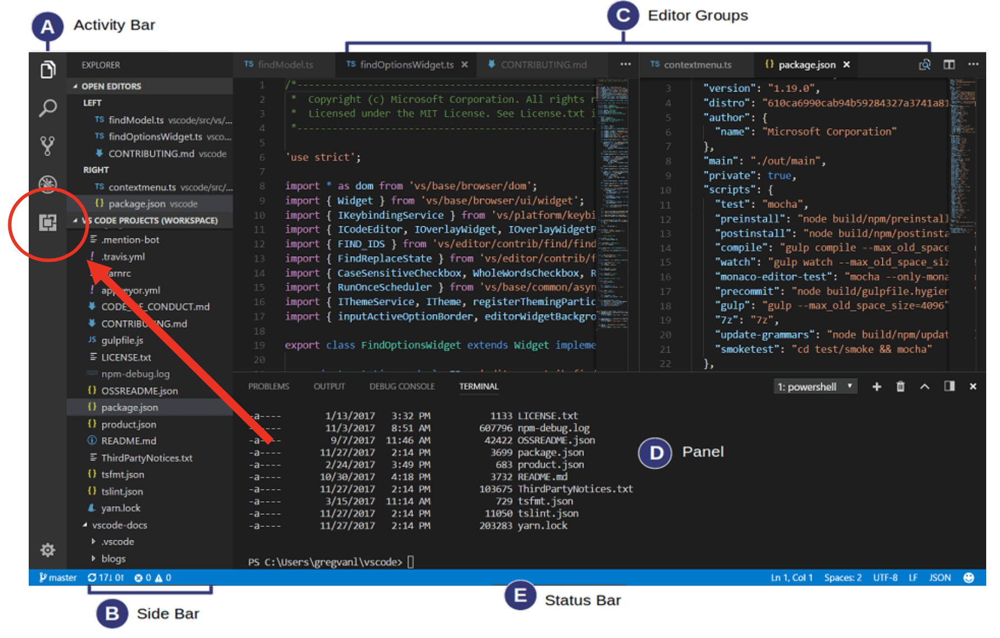

# VSCode

There are many wonderful programming editors that are available. In this course, we will be using Visual Studio Code (VSCode). VSCode has caught the programming world by storm and is now the defacto standard used by millions of programmers throughout the world. It also has excellent integration support for Git and GitHub as well as an extensive list of extensions that can be easily installed in the editor. Although you are not required to use this editor, we will be using it in the videos that you will be watching. We will provide support as best as possible for VSCode to ensure that you are productive using it. We will not provide support for other editors, so if you choose something else you are on your own.

## Install VSCode

Do the following:

- [Download VSCode](https://code.visualstudio.com/) and install it on your computer.
- Learn a little about VSCode by looking at [Getting Started with Visual Studio Code](https://code.visualstudio.com/docs/introvideos/basics).

## Install Extensions

Like many other programming editors, VSCode has a rich set of extensions that you can use to extend the functionality of the editor. To install an extension you want to click on the extension icon in the Activity Bar as shown in the figure below.

This will bring up Extensions pane and allow you to search for extensions. We recommend you install the following extensions:

- [HTML CSS Support](https://marketplace.visualstudio.com/items?itemName=ecmel.vscode-html-css)
- [Live Server](https://marketplace.visualstudio.com/items?itemName=ritwickdey.LiveServer)

There are plenty of other extensions you might be interested in exploring that will allow you to make VSCode more powerful and customized to the way you like it.
